# 💰 Система учета доходов и расходов


Веб-приложение для управления личными финансами с интуитивно понятным интерфейсом и статистикой в реальном времени.

## ✨ Возможности

- ➕ **Добавление транзакций** - доходы и расходы с категоризацией
- 📊 **Статистика в реальном времени** - автоматический расчет баланса
- 🔍 **Фильтрация данных** - по типам операций и датам
- 🗑️ **Управление записями** - удаление транзакций
- 📱 **Адаптивный интерфейс** - удобство на любых устройствах
- ⚡ **Асинхронная работа** - без перезагрузки страницы

## 🛠️ Технологический стек

### Backend
- **PHP 7.x/8.x** - серверная логика
- **MySQL 8.0** - хранение данных
- **PDO** - безопасное подключение к БД

### Frontend
- **HTML5** - семантическая разметка
- **CSS3** - адаптивные стили
- **JavaScript (ES6+)** - клиентская логика
- **Fetch API** - асинхронные запросы

### Инфраструктура
- **OpenSERVER** - локальный сервер
- **phpMyAdmin** - управление БД
- **UTF-8mb4** - полная поддержка Unicode

## 🚀 Быстрый старт

### Предварительные требования

- OpenSERVER 5.4.2 или выше
- PHP 7.4+
- MySQL 5.7+
- Браузер с поддержкой ES6+

### Установка

1. **Клонируйте репозиторий**
```bash
git clone https://github.com/yourusername/finance-manager.git
```
2. **Настройте OpenSERVER**
- Добавьте домен finance.local в настройках
- Укажите путь к папке проекта

3. **Создайте базу данных**
```sql 
CREATE DATABASE finance_manager 
CHARACTER SET utf8mb4 
COLLATE utf8mb4_general_ci;
```

4. **Импортируйте структуру таблицы**
```sql
CREATE TABLE transactions (
    id INT AUTO_INCREMENT PRIMARY KEY,
    type ENUM('income', 'expense') NOT NULL,
    amount DECIMAL(10,2) NOT NULL,
    category VARCHAR(100) NOT NULL,
    description TEXT,
    date DATE NOT NULL,
    created_at TIMESTAMP DEFAULT CURRENT_TIMESTAMP
) ENGINE=InnoDB DEFAULT CHARSET=utf8mb4;
```

5. **Настройте подключение к БД**
- Отредактируйте config/database.php:
```php
private $username = "root";      // Ваш пользователь MySQL
private $password = "password";  // Ваш пароль MySQL
```

6. **Запустите приложение**
- Запустите OpenSERVER
- Перейдите по адресу: http://finance.local/

## Структура проекта

```text
finance-manager/
├── config/
│   └── database.php          # Настройки подключения к БД
├── ajax/
│   ├── add_transaction.php   # Добавление транзакций
│   ├── get_transactions.php  # Получение списка транзакций
│   └── delete_transaction.php # Удаление транзакций
├── css/
│   └── style.css             # Стили приложения
├── js/
│   └── script.js             # Клиентская логика
├── index.php                 # Главная страница
└── README.md
```

## 🎯 Использование

### Добавление транзакции
1. Выберите тип операции: Доход или Расход
2. Укажите сумму (только положительные числа)
3. Введите категорию (например: "Зарплата", "Продукты")
4. Добавьте описание (опционально)
5. Выберите дату операции
6. Нажмите "Добавить"

### Просмотр статистики
1. Общий доход - сумма всех доходных операций
2. Общий расход - сумма всех расходных операций
3. Баланс - разница между доходами и расходами

## Фильтрация данных
- По типу: Все / Доходы / Расходы
- По дате: Конкретная дата (опционально)

## 🔧 Архитектура и безопасность

### Клиент-серверное взаимодействие

```mermaid
    graph LR
    A[Клиент] --> B[AJAX Request]
    B --> C[PHP Backend]
    C --> D[MySQL Database]
    D --> C
    C --> E[JSON Response]
    E --> A
```

